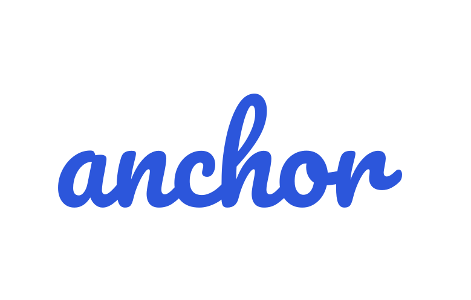

<h3 align="center" id="anchor-logo"></h3>

<p align="center">
  <a href="https://img.shields.io/github/go-mod/go-version/ZachiNachshon/anchor/master">
    
  </a>
  <a href="https://github.com/ZachiNachshon/anchor/actions/workflows/ci.yaml/badge.svg?branch=master">
    
  </a>
  <a href="https://goreportcard.com/badge/ZachiNachshon/anchor">
    
  </a>
  <a href="https://coveralls.io/repos/github/ZachiNachshon/anchor/badge.svg?branch=master">
    
  </a>
  <a href="https://github.com/ZachiNachshon/anchor/releases">
    
  </a>
<!--   <a href="https://img.shields.io/github/downloads/ZachiNachshon/anchor/total">
    
  </a> -->
  <a href="https://opensource.org/licenses/MIT">
    
  </a>
  <a href="https://www.paypal.me/ZachiNachshon">
    
  </a>
</p>

<p align="center">
  <a href="#requirements">Requirements</a> •
  <a href="#quickstart">QuickStart</a> •
  <a href="#overview">Overview</a> •
  <a href="#support">Support</a> •
  <a href="#license">License</a>
</p>
<br>

**Anchor** allows you to create dynamic CLI's as your **GitOps marketplace**. It connects to any git repository with a simple opinionated structure and expose executable commands as **dynamic command-line-interface utility** to use from any environment, CI and local.

**Anchor** can help in reducing the amount of CLI utilities created in a variety of languages in an organization, it does so by connecting to an existing/new git repositories and exposing what is required such as shell scripts, Python scripts, binary usage with options/arguments or any other executable.

**Anchor** has two modes for running an actions / actions-sets (workflows):

- **Interactive** menu selector enriched with documentation
- **Non-interactive** mode i.e. direct CLI command

| :heavy_exclamation_mark: WARNING |
| :--------------------------------------- |
| Anchor is still in **alpha stage**, breaking changes might occur. |

<br>

<h2 id="requirements">🏴‍☠️ Requirements</h2>

- A Unix-like operating system: macOS, Linux
- `git` (recommended v2.30.0 or higher)

<br>

<h2 id="quickstart">⚡️ QuickStart</h2>

The fastest way (for `macOS` and `Linux`) to install `anchor` is using [Homebrew](https://brew.sh/):

```bash
brew install ZachiNachshon/tap/anchor
```

Alternatively, tap into the formula to have brew search capabilities on that tap formulas:

```bash
# Tap
brew tap ZachiNachshon/tap

# Install
brew install anchor
```

For additional installation methods [read here](https://zachinachshon.com/anchor/docs/latest/getting-started/download/).

<br>

<h2 id="overview">⚓️ Overview</h2>

- [Why creating `Anchor`?](#why-creating-anchor)
- [Documentation](#documentation)
- [Playground](#playground)

**Maintainers / Contributors:**

- [Contribute guides](https://zachinachshon.com/anchor/docs/latest/getting-started/contribute/)

<br>

<h3 id="why-creating-anchor">⛵ Why Creating <code>Anchor</code>?</h3>

1. Allow a better experience on repositories containing lots of scripts managed by multiple teams, make them approachable and safe to use by having a documented and controlled process with minimum context switches for *running scripts / installing applications / orchestrate installations / do whatever you require*

1. Allowing to compose different actions from multiple channels (shell scripts, CLI utilities etc..) into a coherent well documented workflow with rollback procedure

1. Having an action / workflow execution plan explained in plain english and managed via a central versioned controlled remote repository in a GitOps way that can be shared with others to use easily

1. Remove the fear of running an arbitrary undocumeted script that relies on ENV vars to control its execution

1. Using an agnostic client that doesn’t change, rather, changes are reflected based on the remote git repository(ies) it relies on

1. Reduce the amount of CLI utilities created in a variety of languages in an organization

<br>

<h3 id="documentation">📖 Documentation</h3>

Please refer to the [documentation](https://zachinachshon.com/anchor/docs/latest/getting-started/introduction/) for detailed explanation on how to configure and use `anchor`.


<br>

<h3 id="playground">🐳 Playground</h3>

Follow these steps to connect to a remote git playground repository and check the dynamic CLI live experience. **All actions are no-op**, you can safely run them as they only print to stdout.

Take `anchor` for a spin using the following steps, connect to a remote playground repository and check the different use-cases it might be used for:

1. Register to a remote git playground repository and set it as the default config context:

   ```bash
   anchor config set-context-entry playground \
      --repository.remote.url=https://github.com/ZachiNachshon/anchor-playground.git \
      --repository.remote.autoUpdate=false \
      --set-current-context
   ```

1. Type `anchor` to fetch the repository and print all available commands

1. Check which items are available under the `team-infra` command:

   ```bash
   anchor team-infra status
   ```
   
1. Select the `team-infra` command to start an interactive action selection, try running an action/workflow:

   ```bash
   anchor team-infra select
   ```
   
1. Use the `run` command to run an action non-interactively:

   ```bash
   anchor team-infra run backoffice --action=install-jenkins-master
   ```

1. Run an action-set (workflow) non-interactively:

   ```bash
   anchor team-infra run backoffice --workflow=provision-jenkins-server-agents
   ```
   
1. Use other playground commands and run different actions to check different use cases

   | :bulb: Note |
   | :--------------------------------------- |
   | This is a quick overview just to get a grasp of how simple it is to use `anchor`.<br/>To add `anchor` support to an existing or new git repository, please [read the documentation](https://zachinachshon.com/anchor/docs/latest/getting-started/). |

<br>

<h2 id="support">Support</h2>

Anchor is an open source project that is currently self maintained in addition to my day job, you are welcome to show your appreciation by sending me cups of coffee using the the following link as it is a known fact that it is the fuel that drives software engineering ☕

<a href="https://www.buymeacoffee.com/ZachiNachshon" target="_blank"></a>

<br>

<h2 id="license">License</h2>

MIT

<br>
