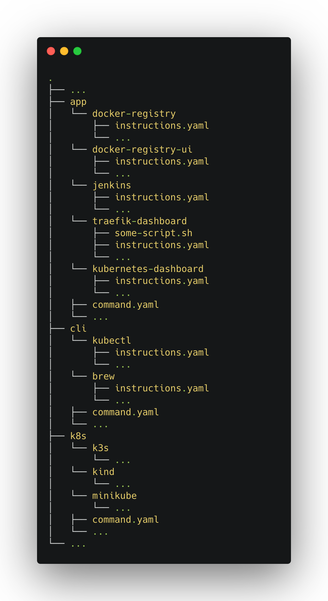
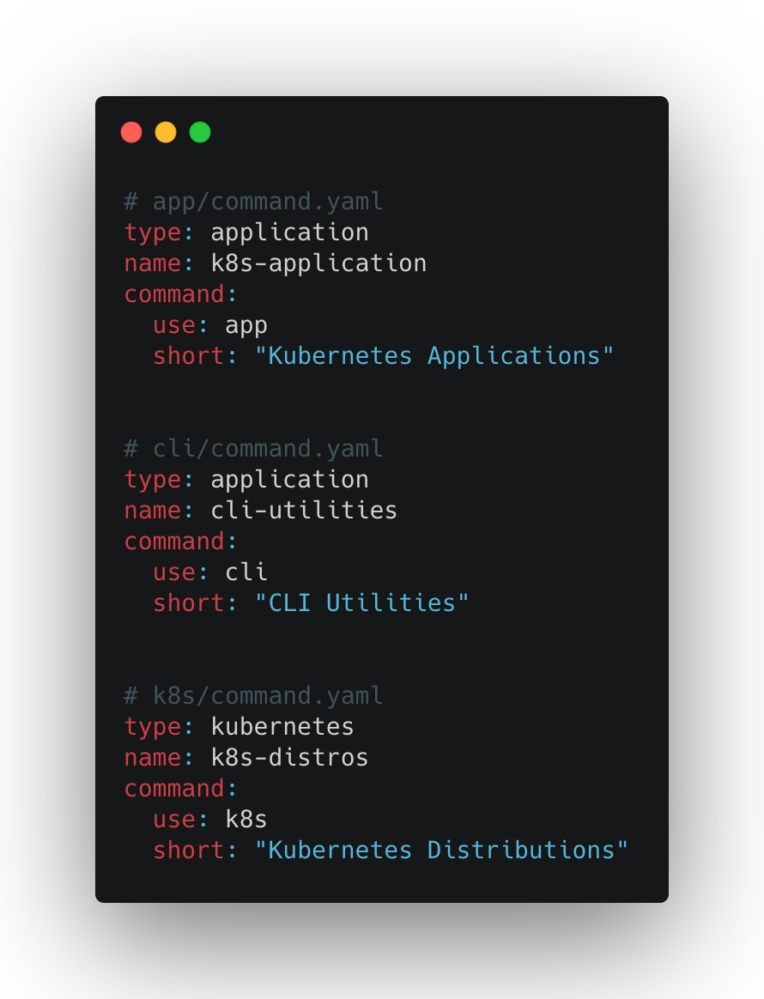
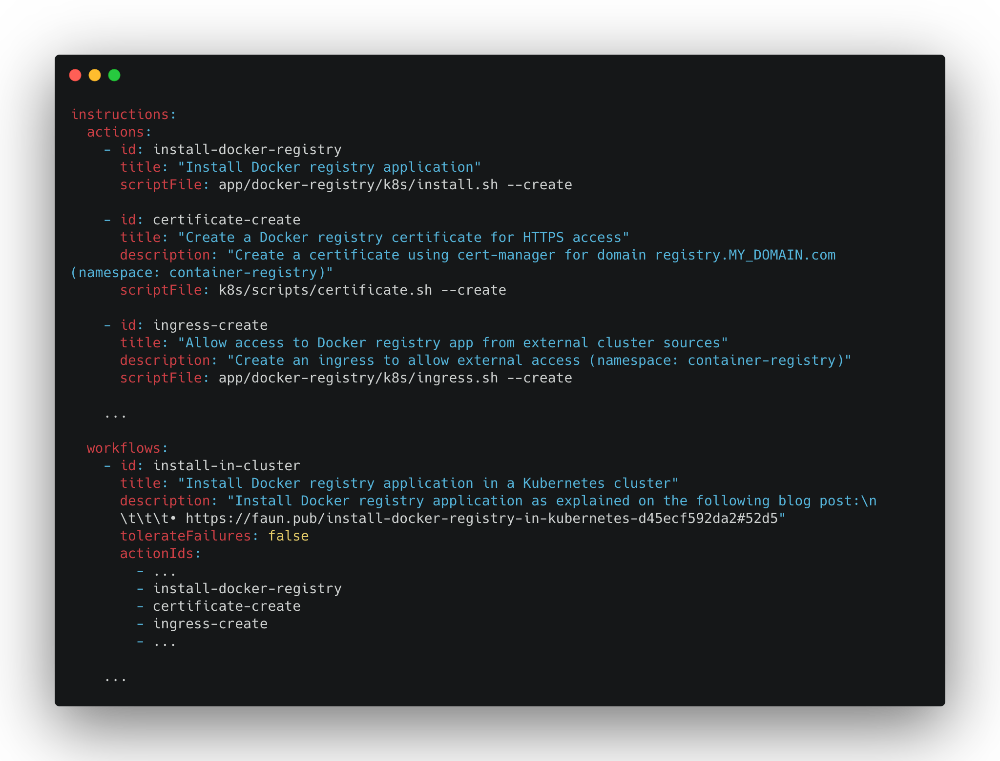
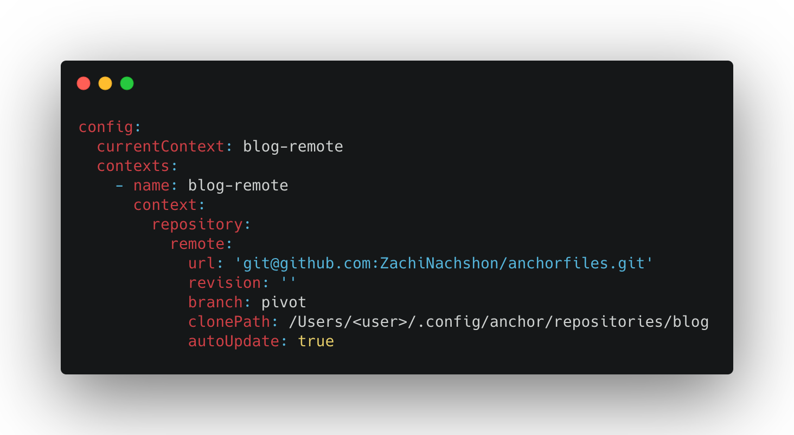
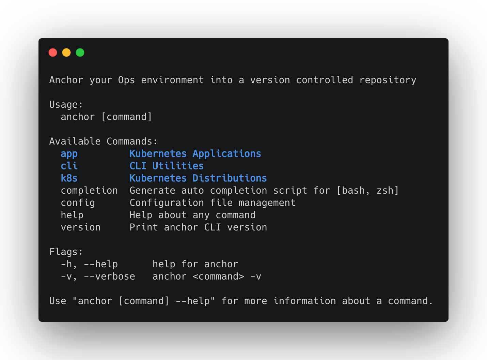
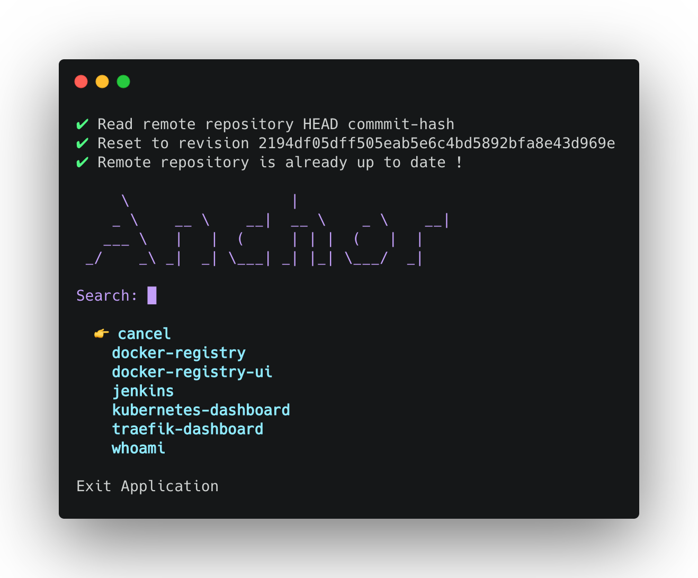

<h3 align="center" id="anchor-logo"></h3>

<p align="center">
  <a href="https://img.shields.io/github/go-mod/go-version/ZachiNachshon/anchor/master">
    
  </a>
  <a href="https://github.com/ZachiNachshon/anchor/actions/workflows/ci.yaml/badge.svg?branch=master">
    
  </a>
  <a href="https://goreportcard.com/badge/ZachiNachshon/anchor">
    
  </a>
  <a href="https://coveralls.io/repos/github/ZachiNachshon/anchor/badge.svg?branch=master">
    
  </a>
  <a href="https://github.com/ZachiNachshon/anchor/releases">
    
  </a>
  <a href="https://img.shields.io/github/downloads/ZachiNachshon/anchor/total">
    
  </a>
  <a href="https://opensource.org/licenses/MIT">
    
  </a>
  <a href="https://www.paypal.me/ZachiNachshon">
    
  </a>
</p>

<p align="center">
  <a href="#requirements">Requirements</a> •
  <a href="#quickstart">QuickStart</a> •
  <a href="#overview">Overview</a> •
  <a href="#support">Support</a> •
  <a href="#license">License</a>
</p>
<br>

**Anchor** is a lightweight CLI tool that grants the **dynamic marketplace** experience for local / CI environment by connecting to single/multiple remote repositories, each represents a different marketplace of domain, each with its own executable actions.

Every marketplace repository allows Anchor to **centralize and organize** a set of domain items into their own categories, every domain containing a list of executable single **action** and/or grouped actions (**workflows**) per item in a coherent, visible and easy-to-use approach. 

**Anchor** connects to remote git repositories containing an opinionated structure that allows it to understand what is available, exposing pre-defined **categories** as a dynamicly created CLI commands with their underlying domain items as **actions / workflows (actions-sets)** using an **interactive** selector enriched with **documentation** or in a **non-interactive** mode via direct CLI command.

| :heavy_exclamation_mark: WARNING |
| :--------------------------------------- |
| Anchor is still in **alpha stage**, breaking changes might occur, use it with caution ! |

<br>

<h2 id="requirements">🏴‍☠️ Requirements</h2>

- A Unix-like operating system: macOS, Linux
- `git` (recommended v2.30.0 or higher)

<br>

<h2 id="quickstart">⚡️ QuickStart</h2>

The fastest way (for `macOS` and `Linux`) to install `anchor` is using [Homebrew](https://brew.sh/). For additional installation methods [read here](docs/installation.md).

```bash
# Tap to formulas repository
brew tap ZachiNachshon/tap

# Install package
brew install anchor

# Alternatively, tap and install via a single command
brew install ZachiNachshon/tap/anchor
```

<br>

<h2 id="overview">⚓️ Overview</h2>

- [Why creating `Anchor`?](#why-creating-anchor)
- [How does it work?](#how-does-it-work)
- [Create a marketplace repository](docs/create-anchorfiles.md)
- [Configuration](docs/configuration.md)
- [Available features](docs/available-features.md)

**Maintainers / Contributors:**

- [Other installation methods](docs/installation.md)
- [Contribute guides](docs/contribute.md)

<br>

<h3 id="why-creating-anchor">⛵ Why Creating <code>Anchor</code>?</h3>

1. I believe that local environment management should be a *smooth sailing* - documented process with minimum context switches for *running scripts / installing applications / orchestrate installations / do whatever you require* on it
1. Allowing to compose different actions from multiple channels (shell scripts, CLI utilities etc..) into a coherent well documented workflow with rollback procedure
1. Having an action / workflow execution plan explained in plain english and managed via a central versioned controlled remote repository that can be shared with others to use
1. Using an agnostic client that doesn't change, rather, changes are reflected based on remote marketplace state

<br>

<h3 id="how-does-it-work">🗺 How Does It Work?</h3>

To quickly get started follow these steps: 

1. Create a structured repository (a.k.a *anchorfiles*) as the remote marketplace

   <details><summary>Show</summary>
   
   </details>

1. Create dynamic CLI command(s) using ***command.yaml*** schemas on the remote repository 

   <details><summary>Show</summary>
   
   </details>

1. Define actions / workflows for every dynamic CLI command item using an ***instructions.yaml*** file

   <details><summary>Show</summary>
   
   </details>

1. Use the remote marketplace in anchor ***config.yaml*** file

   <details><summary>Show</summary>
   
   </details>

1. Run `anchor` and select the dynamically created CLI command(s) to use

   <details><summary>Show</summary>
   
   </details>

1. Select a command item and an action / workflow to execute interactively

   <details><summary>Show Command Item Selection</summary>
   
   </details>

   <details><summary>Show Command Item Action Selection</summary>
   
   </details>

1. Alternatively, run a command item action / workflow non-interactively

   <details><summary>Show Complete Run Command</summary>
   <p>
   
   ```bash
   anchor app run docker-registry --action=install-docker-registry
   ```
   
   </p>
   </details>
   
   | :bulb: Note |
   | :--------------------------------------- |
   | This is a quick overview just to get a grasp of how simple it is to use *anchor*.<br>Detailed guide can be found on the [create a marketplace repository](docs/create-anchorfiles.md) section. |

<br>

<h2 id="support">Support</h2>

Anchor is an open source project that is currently self maintained in addition to my day job, you are welcome to show your appreciation by sending me cups of coffee using the the following link as it is a known fact that it is the fuel that drives software engineering ☕

<a href="https://www.buymeacoffee.com/ZachiNachshon" target="_blank"></a>

<br>

<h2 id="licence">Licence</h2>

MIT

<br>
