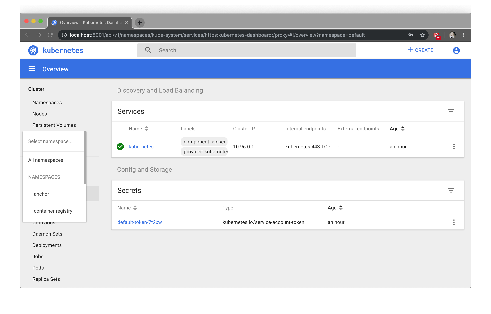
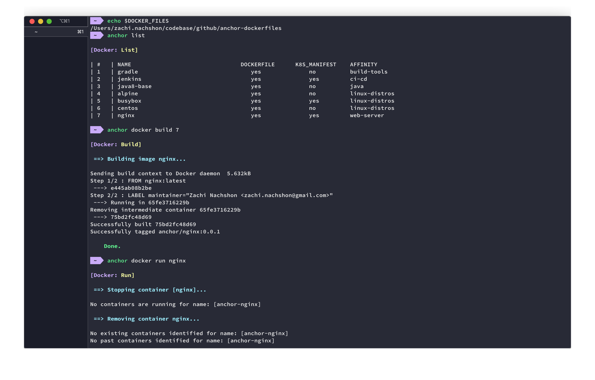
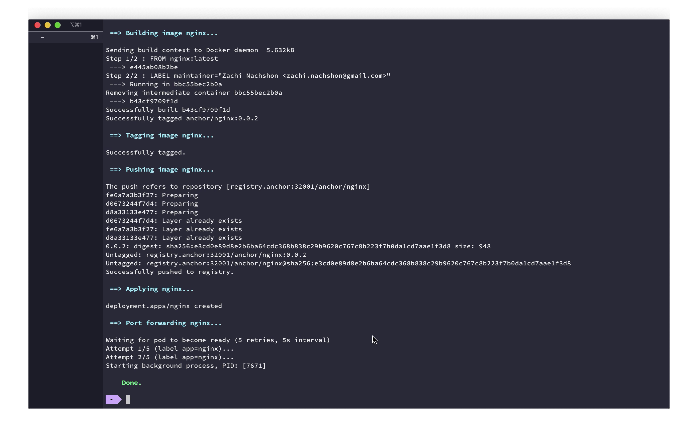
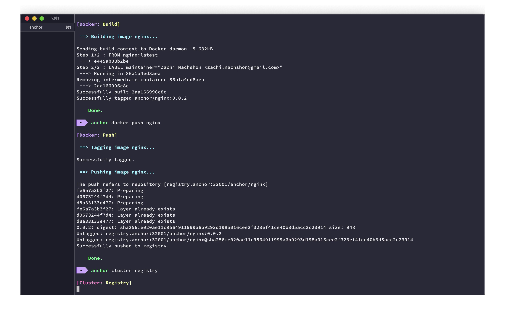
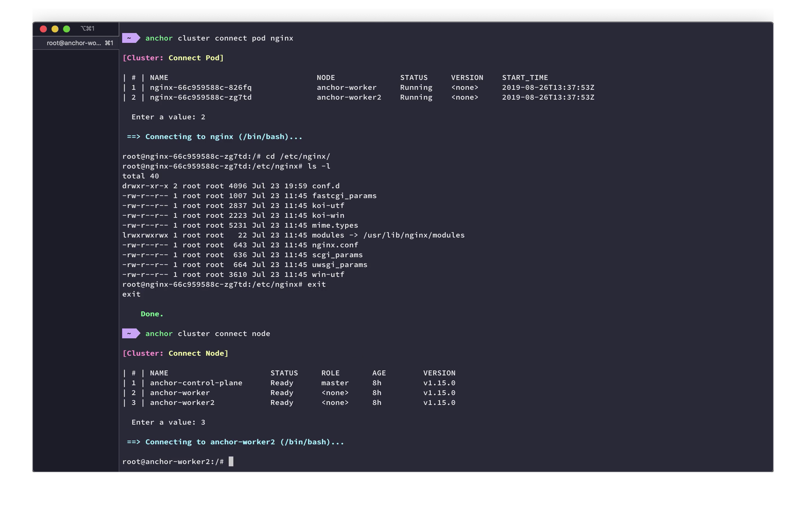

<h2>Anchor is a CLI tool on top of k8s KinD and Docker</h2>

<h3 align="center" id="wixperiments-features"></h3>

<p align="center">
  <a href="https://travis-ci.com/ZachiNachshon/anchor">
    
  </a>
  <a href="https://opensource.org/licenses/MIT">
    
  </a>
</p>

<h2 id="overview">Overview</h2>

Anchor is a CLI tool for local development that simplify interactions with:

- Local Kubernetes cluster running on top of KinD
- Docker containers

It is based on:

- [Docker](https://github.com/docker) for running containerized applications
- [KinD](https://github.com/kubernetes-sigs/kind) for running local Kubernetes cluster within a docker container
- [Kubectl](https://github.com/kubernetes/kubernetes/tree/master/pkg/kubectl) for running commands against Kubernetes clusters 
- [Hostess](https://github.com/cbednarski/hostess) for managing your `/etc/hosts` file
- [Homebrew](https://github.com/Homebrew/brew) for managing macOS / Linux packages

> **Note:**<br/>
> Anchor is utilizing the following components: `docker`, `kind`, `kubectl`, `envsubst`, `hostess`. If they can't be found on your machine, `Homebrew` is prompt for installation to fetches them for you.

<h2 id="why">Why</h2>

1. Allow a repository to become an _anchor_ for all Docker / Kubernetes scripts scattered all over
1. Keep docker commands (e.g. `build`/`run`/`tag`/`push`) on the same `Dockerfile` they should get executed on
1. Keep `kubectl` commands on the same YAML manifest they should get executed on
1. Encapsulate commonly used, repetitive Docker / Kubernetes actions as simple CLI commands
1. Development environment should strive to be the same as production, deploy locally the same as you deploy to production

<h2 id="whats-in-the-box">What's in the box</h2>

- Private docker registry deployed on control-plane with multi node support
- Allow stateful volume `mountPath` / `hostPath` between local and a running pod within the KinD container via the node selector: `app-name: anchor-stateful`
- Selection menu for quick connect to any node / pod 

<h2 id="requirements">Requirements</h2>

- Go 1.13.x

<h2 id="quick-start-guide">Quick Start Guide</h2>

1. Download Anchor CLI tool:

	**I don't have GO environment**

	- Download your OS and ARCH relevant binary from [releases](https://github.com/ZachiNachshon/anchor/releases), unzip and place in `/usr/bin` or `usr/local/bin` or add to `$PATH`
	
	**I do have GO environment**

	- 	Without source code
			
		```bash
		~$ go get github.com/ZachiNachshon/anchor@v0.3.0
		```

	- 	With source code
		
		```bash
		~$ git clone https://github.com/ZachiNachshon/anchor.git ${GOPATH}/src/github.com/anchor
		~$ cd {GOPATH}/src/github.com/anchor
		~$ make build
		```

1. Clone complementary repo `anchor-dockerfiles` and set `DOCKER_FILES` env var:

	```bash
	~$ sh -c "$(curl -fsSL https://raw.githubusercontent.com/ZachiNachshon/anchor/master/scripts/quick-start.sh)"
	```
	
	**What's included in the script?**
	
	- Clone `anchor-dockerfiles` to `${HOME}/.anchor` 
	- Set `DOCKER_FILES` environment variable to `${HOME}/.anchor/anchor-dockerfiles` 
	
	> **Note:**<br/>
	> Consider setting `DOCKER_FILES` as permanent environment variable (append to `$PATH`)

<h2 id="how-does-it-work">How does it work</h2>

**Directory Structure & Instructions**

An environment variable `DOCKER_FILES` is pointing to a local directory path with specific structure layout containing the dockerfiles and k8s manifests.<br/> 
Please refer to the sample [anchor-dockerfiles](https://github.com/ZachiNachshon/anchor-dockerfiles) repository for additional details.

<h2 id="usage-example">Usage Examples</h2>

<details><summary>Create an `anchor` Kubernetes cluster</summary>

[](https://youtu.be/4XCf3M424Gk)
</details>

<details><summary>Build and run `nginx` as a docker container</summary>

[](https://youtu.be/7PtbKPpiJIA)
</details>

<details><summary>Auto deploy `nginx` to Kubernetes</summary>

[](https://youtu.be/7Tdx1GHaQ50)
</details>

<details><summary>Manual deploy `nginx` to Kubernetes</summary>

[](https://youtu.be/urmfVmYi5BE)
</details>

<details><summary>Connect to a running Kubernetes pod/node</summary>

[](https://youtu.be/O25weLHGC-M)
</details>

<h2 id="still-in-progress">Still in progress</h2>

- After macOS restart `kubectl` is losing cluster context
- Use `stty sane` to avoid terminal input errors such as `^M` on Enter
- Add the ability to delete an image from private docker registry 
- Add `-y` flag to skip all prompts using default values
- Tests coverage 

<h2 id="available-anchor-commands">Available Anchor commands</h2>

List of available `anchor docker` commands:

```bash
Usage:
  anchor docker [command]

Aliases:
  docker, d

Available Commands:
  build       Builds a docker image
  log         Log a running docker container
  purge       Purge all docker images and containers
  push        Push a docker image to repository [registry.anchor]
  remove      Remove docker containers and images
  run         Run a docker container
  stop        Stop a docker container

Flags:
  -h, --help   help for docker

Global Flags:
  -v, --verbose   anchor <command> -v
```

List of available `anchor cluster` commands:

```bash
Usage:
  anchor cluster [command]

Aliases:
  cluster, c

Available Commands:
  apply       Apply a Kubernetes manifest resource
  backup      Backup a stateful mounted volume
  connect     Connect to a kubernetes [node, pod] by name
  create      Create a local Kubernetes cluster
  dashboard   Deploy a Kubernetes dashboard
  delete      Delete a previously deployed Kubernetes resource
  deploy      Deploy a fully managed Kubernetes resource
  destroy     Destroy local Kubernetes cluster
  expose      Expose to the host instance a container port of a deployed Kubernetes resource
  logs        Log a running kubernetes pod by name
  registry    Create a private docker registry [registry.anchor]
  status      Print cluster [anchor] status
  token       Generate export KUBECONFIG command and load to clipboard

Flags:
  -h, --help   help for cluster

Global Flags:
  -v, --verbose   anchor <command> -v
```