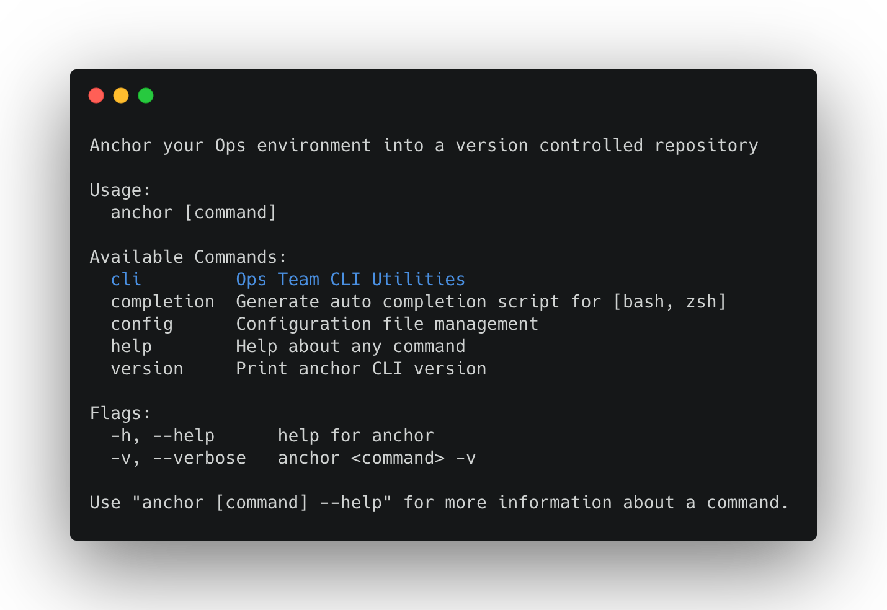
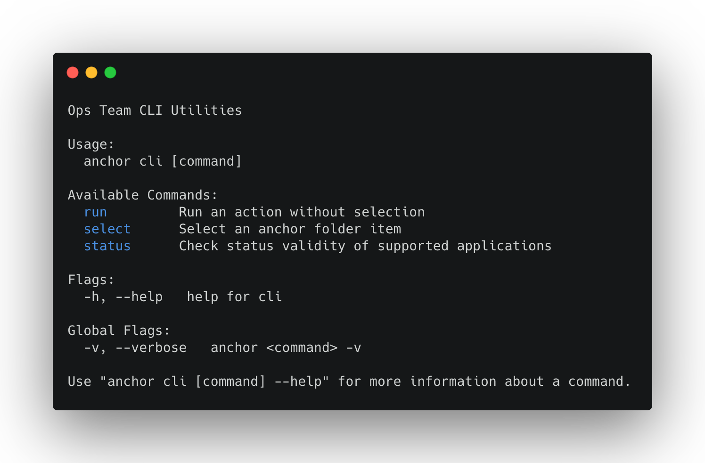
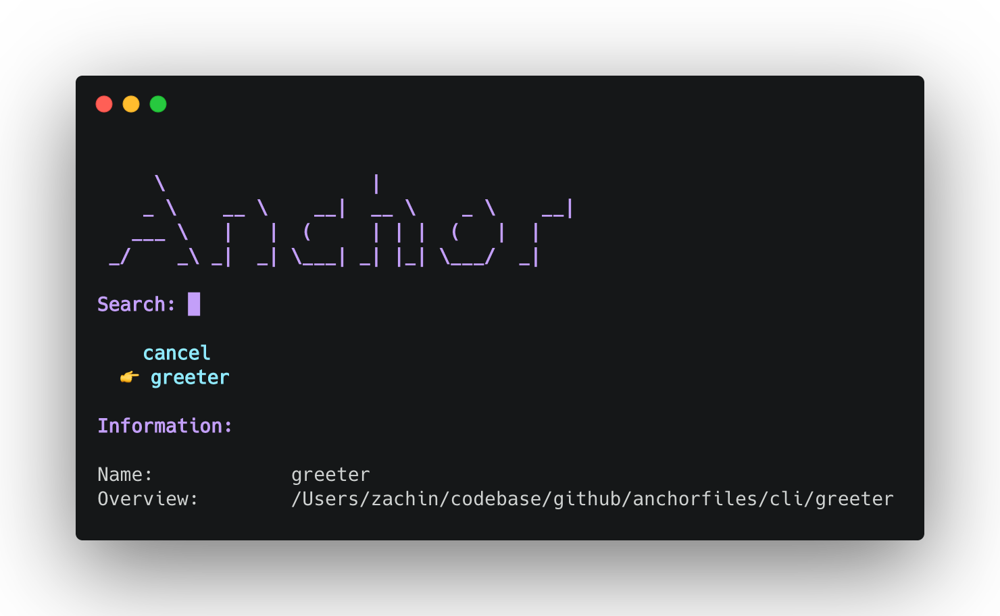
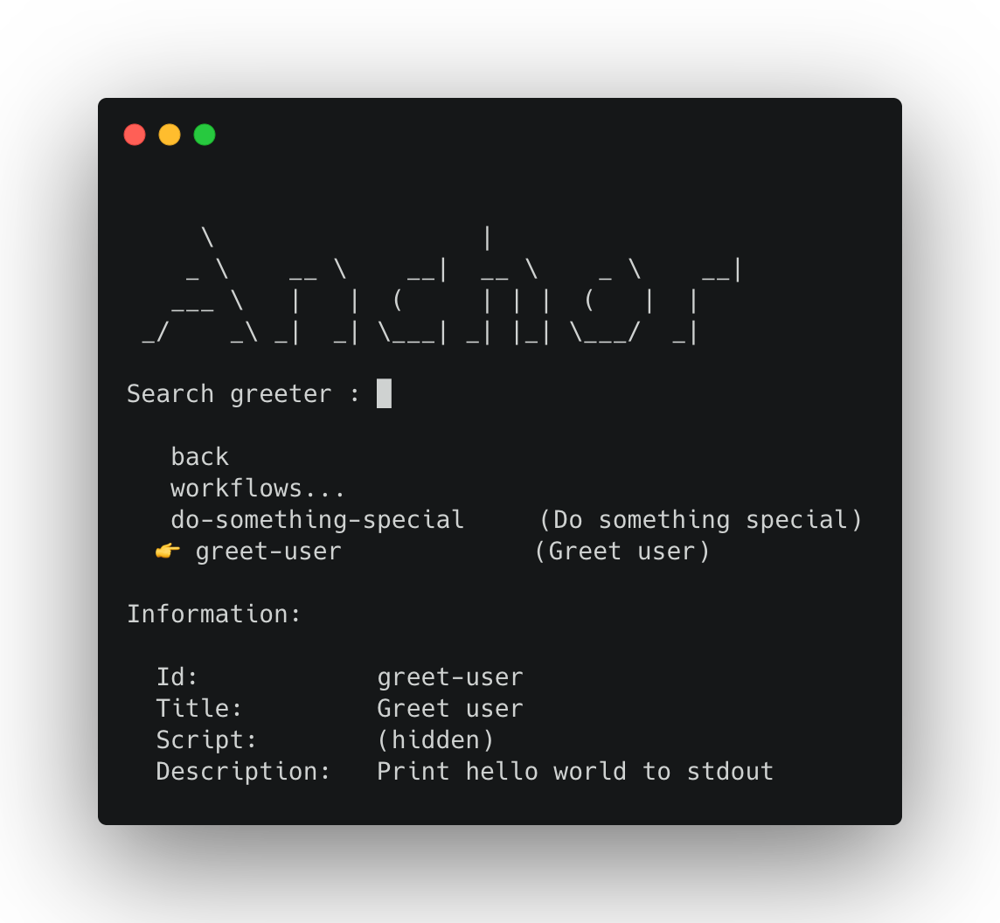
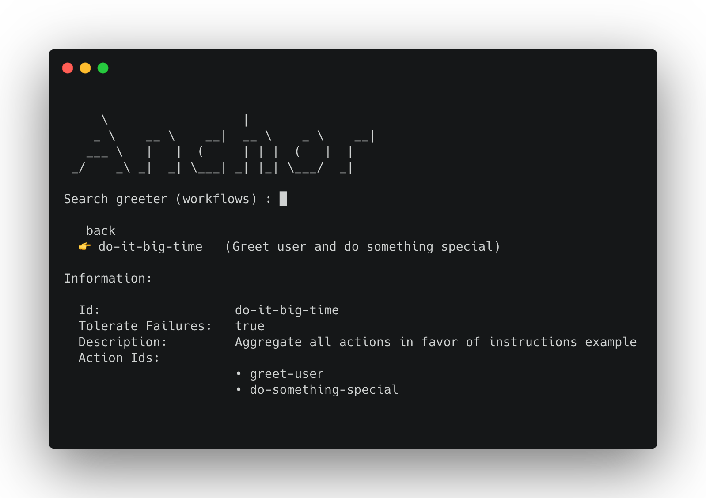

<h1 id="create-anchorfiles" align="center">Create a Marketplace Repository<br><br></h1>

- [Repository Structure](#structure)
  - [The `command.yaml` file](#command)
  - [The `instruction.yaml` file](#instruction)
- [Register Remote Repository in `Anchor` Client](#register)

<br>

<h2 id="structure">Repository Structure</h2>

Anchor relies on a remote repository to act as a marketplace. In order for it to properly parse the marketplace content and extract the items and their respective actions / workflows, a simple structure should be followed when creating the repository.

This is an example template of a marketplace respository:

   ```bash
   ├── ...
   ├── <command-folder>                   
   │   └── <command-folder-item>               
   │       ├── instructions.yaml
   │       ├── <additional-files-and-folders>
   │       └── ...       
   │   ├── command.yaml
   │   ├── <additional-files-and-folders>
   │   └── ...                
   └── ...  
   ```

<br>

<h3 id="command">The <code>command.yaml</code> file</h3>

This file represent a dynamicly created CLI command, every folder containing the `command.yaml` file is going to become an executable CLI command within the `anchor` CLI containing the following sub-commands: `run`, `select`, `status`.

Use the following format to create a dynamic marketplace command:

```yaml
name: <command-name>
description: <command-long-description>
command:
  use: <command-cli-usage>
  short: <command-cli-short-description>
```

Example:

```yaml
name: cli-utilities
decription: "Ops utilities for managing a local/CI environment" 
command:
  use: cli
  short: "Ops Team CLI Utilities"
```

<details><summary>Show Command</summary>

</details>

<details><summary>Show Sub-Commands</summary>

</details>

<br>

<h3 id="instruction">The <code>instruction.yaml</code> file</h3>

This file purpose is declaring which actions / workflows are avaiable for a specific command folder item and how one should interact with it. The `instructions.yaml` file is a list of actions / workflows that gets picked up by *anchor* CLI scan once a command folder is being selected.

Use the following format to declare a set of instructions for a command folder item:

```yaml
instructions:
  actions:
    - id: do-something-special
      title: "Do something special"
      description: "Execute internal script with --hello flag"
      scriptfile: <command-folder>/scripts/do_something.sh --hello=${USER_NAME}
      
    - id: greet-user
      title: "Greet user"
      description: "Print hello world to stdout"
      script: |
        echo "Hello"
        echo "World"

  workflows:
    - id: do-it-big-time
      title: "Do something special and greet user"
      description: "Aggregate all actions in favor of instructions example"
      tolerateFailures: true
      actionIds:
        - do-something-special
        - greet-user

```

<details><summary>Show Item Selection</summary>

</details>

<details><summary>Show Action Selection</summary>

</details>

<details><summary>Show Workflow Selection</summary>

</details>
<br>

<h2 id="register">Register Remote Repository in <code>Anchor</code> Client</h2>

Registering a new marketplace is as simple as running the following `anchor` CLI command:

```bash
anchor config set-context-entry ops-team-context \
    --repository.remote.url=git@github.com:Organization/OpsMarketplace.git
```

<br>

| :bulb: Note |
| :--------------------------------------- |
| There are additional fine grained configurations available for registering a new remote repository, please check the [Configuration](./configuration.md) section for further information. |
