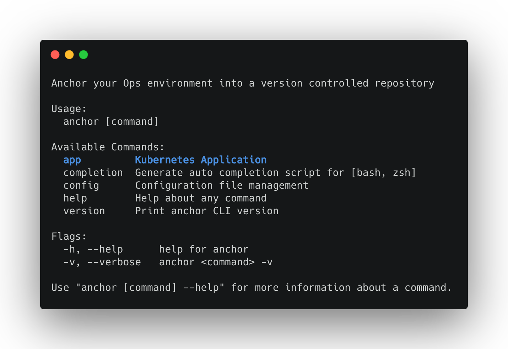
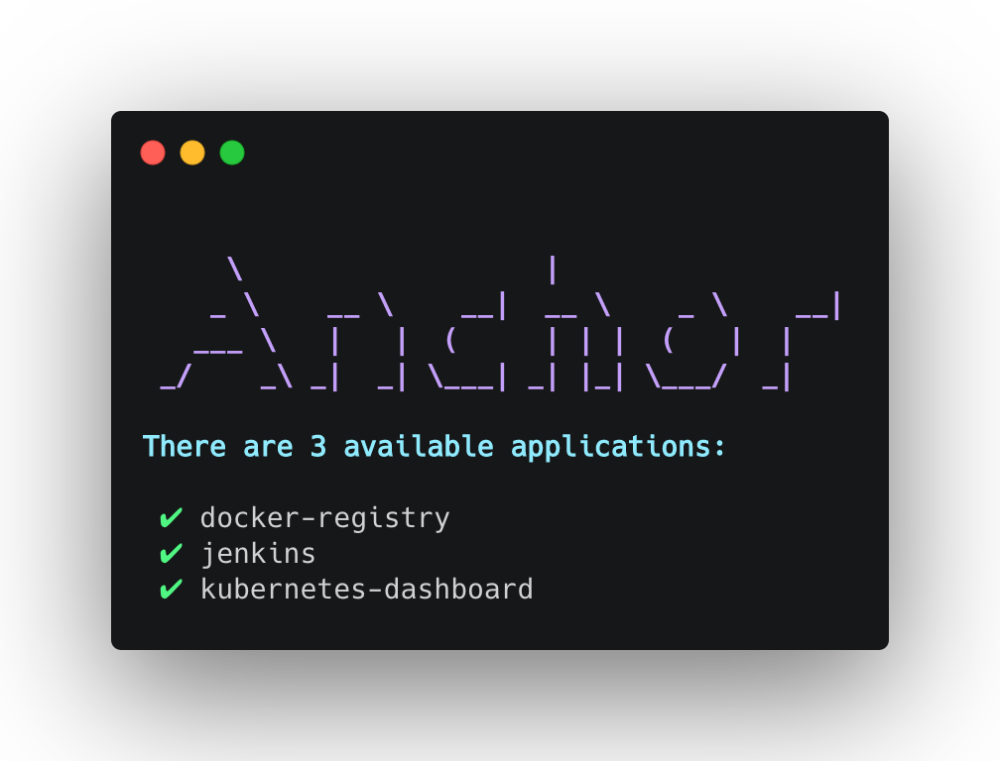
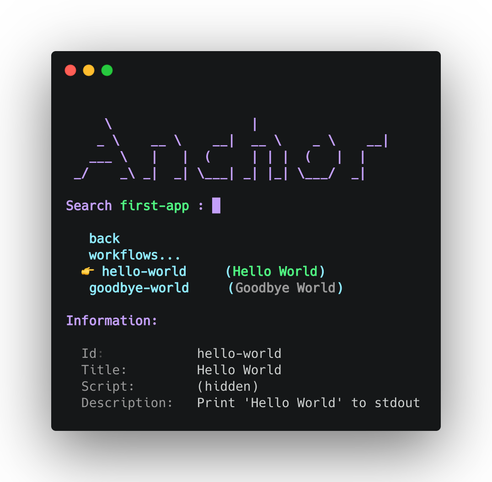
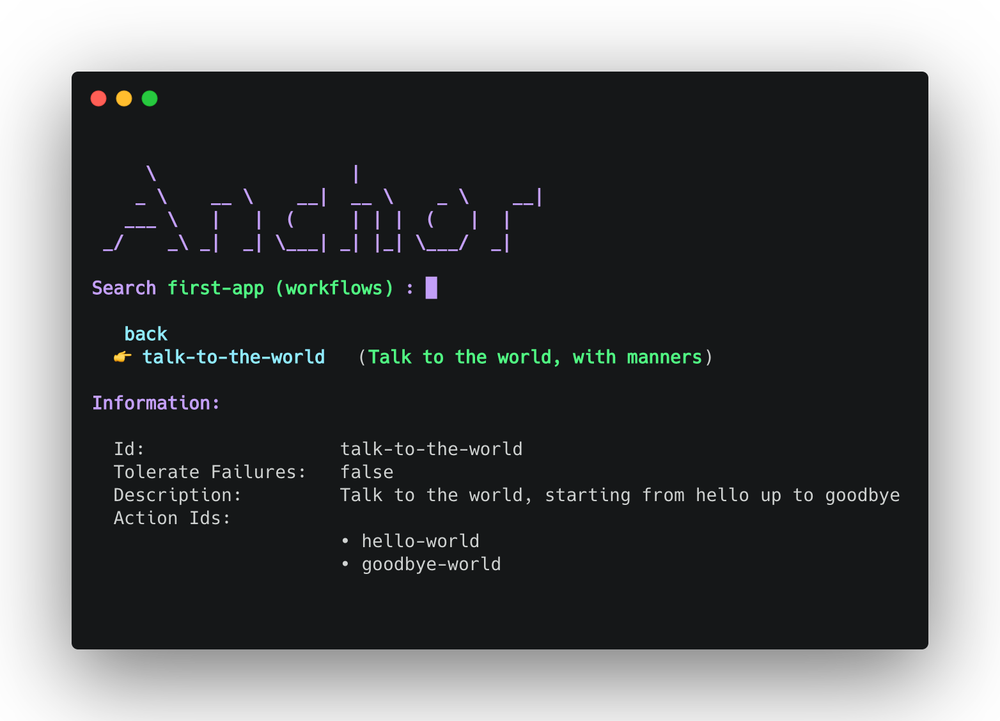
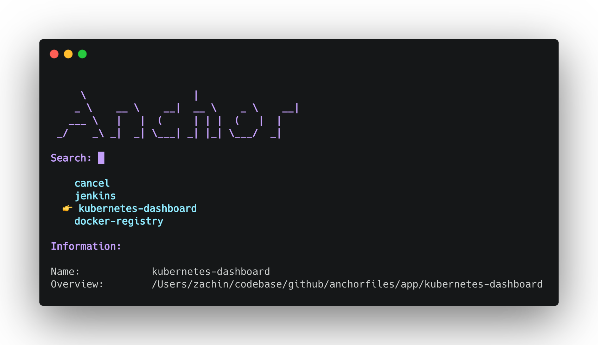
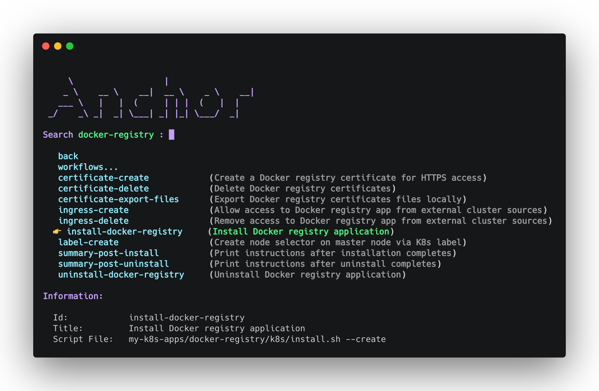

<h1 id="dynamic" align="center">Dynamic Commands<br><br></h1>

- [Overview](#overview)
- [Add a Dynamic Command](#add-command)
  - [Folder Structure](#command-folder-structure)
  - [The `command.yaml` file](#command-file)
- [List Dynamic Commands Items](#status)
  - [Folder Structure](#items-folder-structure)
  - [The `instructions.yaml` file](#instructions-file)
- [Add a New Command Action](#add-action)
  - [Attributes](#action-attributes)
  - [YAML Structure](#action-structure)
  - [Interactive CLI](#action-interactive-cli)
- [Create a Workflow (Action-Set)](#add-workflow)
  - [Attributes](#workflow-attributes)
  - [YAML Structure](#workflow-structure)
  - [Interactive CLI](#workflow-interactive-cli)
- [Interact with `anchor` Interactively](#select)
- [Interact with `anchor` Non-Interactively](#run)

<br>

<h3 id="overview">Overview</h3>

Every remote marketplace repository `anchor` is configured to work with can have a set of YAML files that allows to customize the way `anchor` interacts with it, exposing different dynamically generated CLI commands with their respective actions / workflows (actions-set).

| :bulb: Note                                                  |
| :----------------------------------------------------------- |
| Make sure to follow the [create a marketplace repository](docs/create-anchorfiles.md) guide to follow the remote repository structure `anchor` relies on. |

<br>

<h3 id="add-command">Add a Dynamic Command</h3>

CLI commands are being generated dynamically by `anchor` based on schema files originate from a remote marketplace repository, each such command can be referred to as a domain category that holds specific items for that domain. 

<h4 id="command-folder-structure">Folder Structure</h4>

For example, let's create a domain category for Kubernetes deployed applications, we will have a folder on the root level named `my-k8s-apps` with a `command.yaml` file within:

   ```bash
   ├── <root-folder>
   ├── ...
   ├── my-k8s-apps 
   │   ├── command.yaml
   │   └── ...                
   └── ...  
   ```

*Every folder from a remote marketplace repository that is expected to become a CLI command should apply this structure :point_up:* 

<br>

<h4 id="command-file">The <code>command.yaml</code> file</h4>

The `my-k8s-apps` folder should have a `command.yaml` file which contains the schema of a dynamically generated CLI command:

```yaml
type: application
name: k8s-application
description: "K8s applications available to install on the Ops team cluster"
command:
  use: app
  short: "Kubernetes Application"
```

<details><summary>Show Dynamic CLI Command</summary>

</details>

<br>

<h3 id="status">List Dynamic Commands Items</h3>

Dynamic command items are being defined via an `instructions.yaml` file, it contains a set of instructions of what is available for that specific domain item and how to interact with it.

<h4 id="items-folder-structure">Folder Structure</h4>

   ```bash
   ├── <root-folder>
   ├── ...
   ├── my-k8s-apps 
   │   └── my-dummy-k8s-application
   │       ├── instructions.yaml
   │       └── ...    
   │   ├── command.yaml
   │   └── ...                
   └── ...  
   ```

<br>

<h4 id="command-file">The <code>instructions.yaml</code> file</h4>

The structure of a single domain item instruction file is of the following:

```yaml
instructions:
  actions:
    ...
  workflows:
    ...
```

To list all available domain items of a single dynamic command, we can issue a pre-defined `status` sub-command to print its comprising items:

```bash
anchor app status
```

<details><summary>Show Dynamic CLI Command Items</summary>

</details>

| :bulb: Note                                                  |
| :----------------------------------------------------------- |
| The `instructions.yaml` file support environment variables substitution that takes place before the file is being processed. Use the env vars as in a regular scripts i.e. `$PWD`, `$YOUR_ENV_VAR` etc... |

<br>

<h3 id="add-action">Add a New Command Action</h3>

Action is part of the dynamic command item instructions. It is a single executable instruction definition.

<h4 id="action-attributes">Attributes</h4>

| **Name**                                                     | **Type** | **Default value** |
| :----------------------------------------------------------- | :------- | :---------------- |
| `id`                                                         | `string` |      |
| Identifier, used as the interactive selector |          |                   |
| `title`                                                      | `string` |             |
| Short title about what this action is all about, appended to the interactive selector |          |                   |
| `description`                                                | `string` |                   |
| Longer info about the action responsibilities, shown on the information section - off the interactive selector |          |                   |
| `script`                                                     | `string` |                   |
| Free text script content to get executed upon selection, ***mutually exclusive to `scriptFile`*** |          |                   |
| `scriptFile`                                                 | `string` |              |
| Scripted file to get executed upon selection, path is relative to repository root folder, ***mutually exclusive to `script`***<br><br>*For an item named `test-app` located at path `repo-root/my-k8s-apps/test-app/my-scripts/hello.sh`, the `scriptFile` path should be `my-k8s-apps/test-app/my-scripts/hello.sh`* |          |                   |
| `context`                                                     | `string` | `application` |
| Context scope of the action, affects the pre-action execution flow with custom prompt messages<br>Available values:<br>  • `application` - prints basic prompt message before action is executed  <br>  • `kubernetes` - prints Kubernetes current context information before action is executed |  `string`        |  |
| `showOutput`                                                 | `bool`   | `false`       |
| Print action execution output to *stdout* rather than using a spinner indicator for success / failure |||

<br>

<h4 id="action-structure">YAML Structure</h4>

To create a single action, use the following structure:

```yaml
instructions:
  actions:
    - id: hello-world
      ...
      <additional-attributes>
      ...
```

<br>

<h4 id="workflow-interactive-cli">Interactive CLI</h4>

To run the action interactively based on previous examples, run the following CLI command:

```bash
anchor app select
```

<details><summary>Show Interactive Action Selector</summary>

</details>

<br>

<h3 id="add-workflow">Create a Workflow (Action-Set)</h3>

Workflow is an actions-set, meaning, it allows execution of pre-defined actions in a serialized manner. It is a multi executable instructions definitions.

<h4 id="workflow-attributes">Attributes</h4>

| **Name**                                                     | **Type** | **Default value** |
| :----------------------------------------------------------- | :------- | :---------------- |
| `id`                                                         | `string` |      |
| Identifier, used as the interactive selector |          |                   |
| `title`                                                      | `string` |             |
| Short title about what this workflow is all about, appended to the interactive selector |          |                   |
| `description`                                                | `string` |                   |
| Longer info about the workflow responsibilities, shown on the information section - off the interactive selector |          |                   |
| `tolerateFailures`                 | `bool`   | `false`       |
| Continue to the next action upon failure or fail the entire workflow |||
| `context`                                                     | `string` | `application` |
| Context scope of the workflow, affects the selection flow with custom prompt messages<br>Available values:<br>  • `application` - prints basic prompt message before workflow is executed  <br>  • `kubernetes` - prints Kubernetes current context information before workflow is executed |  `string`        |  |
| `actionIds`                                         | `string[]` |              |
| List of ordered action ids to get executed upon workflow selection |          |                   |

<br>

<h4 id="workflow-structure">YAML Structure</h4>

To create a workflow, use the following structure:

```yaml
instructions:
  actions:
    - id: hello-world
      ...
    - id: goodbye-world
      ...

  workflows:
    - id: talk-to-the-world
      title: "Talk to the world, with manners"
      description: "Talk to the world, starting from hello up to goodbye"
      tolerateFailures: false
      actionIds:
        - hello-world
        - goodbye-world
```

<br>

<h4 id="workflow-interactive-cli">Interactive CLI</h4>

To run the workflow interactively based on previous examples, run the following CLI command and select `workflows...` from the selector menu:

```bash
anchor app select
```

<details><summary>Show Interactive Workflow Selector</summary>

</details>

<br>

<h3 id="select">Interact with <code>anchor</code> Interactively</h3>

This section is guided through an example based on previous guides snippets.

Lets create a Kubernetes `my-k8s-apps ` domain category that holds the following items:

- `docker-registry` 
-  `jenkins`
-  `kubernetes-dashboard`

The folder structure should be as follows:


   ```bash
   ├── <root-folder>
   ├── ...
   ├── my-k8s-apps
   │   └── docker-registry               
   │       ├── instructions.yaml
   │       └── ...    
   │   └── jenkins
   │       ├── instructions.yaml
   │       └── ...    
   │   └── kubernetes dashboard
   │       ├── instructions.yaml
   │       └── ...    
   │   ├── command.yaml
   │   └── ...               
   └── ...  
   ```

We will interact with `anchor` using the following command to start the interactive selector:

```bash
anchor app select
```

<details><summary>Show Application Selector Example</summary>

</details>

<details><summary>Show Application Actions Selector Example</summary>

</details>

<br>

<h3 id="run">Interact with <code>anchor</code> Non-Interactively</h3>

// TBD...

<br>

